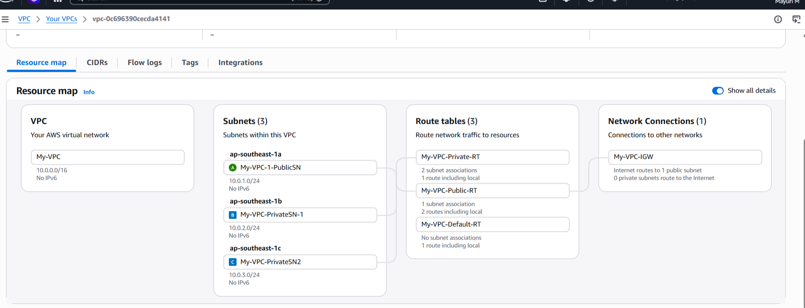
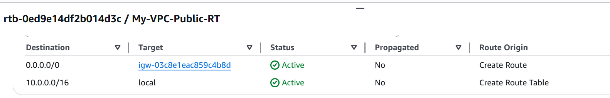
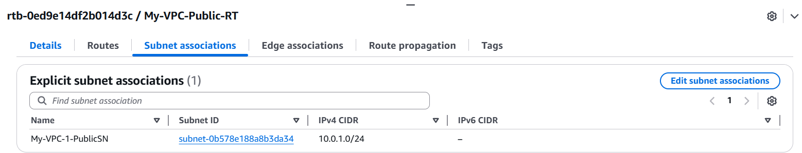
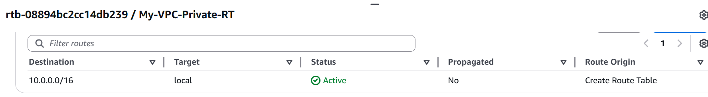
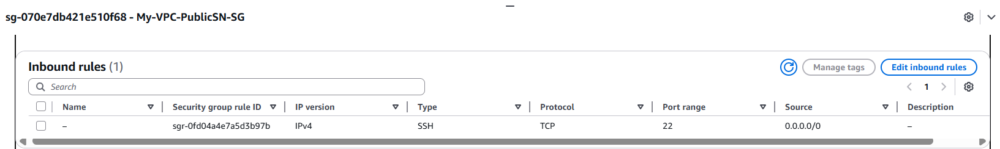
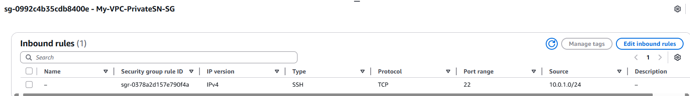
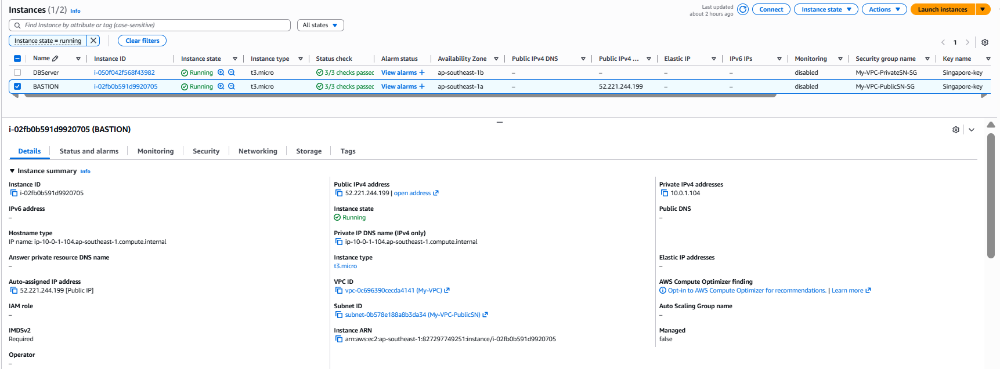
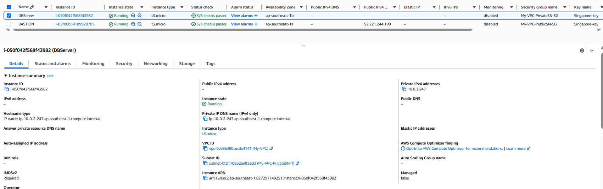

# AWS VPC Architecture with Bastion Host and Private EC2 Access

## Project Overview
This project demonstrates a secure AWS network setup using a custom VPC in the Singapore region.  
The architecture includes one public subnet, two private subnets, separate public and private route tables, an Internet Gateway, security groups, and two EC2 instances.  
A Bastion Host is deployed in the public subnet to securely access a private EC2 instance located in a private subnet using PuTTY over SSH.

## Architecture Components
- 1 Custom VPC
- 1 Public Subnet
- 2 Private Subnets
- 1 Internet Gateway
- 1 Public Route Table
- 1 Private Route Table
- 2 Security Groups
- 2 EC2 Instances
  - Bastion Host
  - DB Server

## AWS Services and Tools Used
- Amazon VPC
- Amazon EC2
- Route Tables
- Internet Gateway
- Security Groups
- PuTTY

## Network Design
- VPC CIDR: `10.0.0.0/16`
- Public Subnet: `10.0.1.0/24`
- Private Subnet 1: `10.0.2.0/24`
- Private Subnet 2: `10.0.3.0/24`

## Steps Performed
1. Created a custom VPC in the Singapore region.
2. Created one public subnet and two private subnets.
3. Created separate public and private route tables.
4. Attached an Internet Gateway to the VPC.
5. Added a default route in the public route table to the Internet Gateway.
6. Associated the public subnet with the public route table.
7. Associated private subnets with the private route table.
8. Created a public security group for the Bastion Host.
9. Created a private security group for the DB Server.
10. Launched the Bastion Host in the public subnet.
11. Launched the DB Server in the private subnet.
12. Connected to the Bastion Host using PuTTY over SSH.
13. Connected to the DB Server from the Bastion Host using PuTTY over SSH.

## Security Design
- The Bastion Host is placed in the public subnet for controlled remote access.
- The DB Server is placed in a private subnet and is not directly accessible from the internet.
- The public security group allows SSH access.
- The private security group allows SSH access only from the trusted internal source.
- This setup improves security by isolating backend resources in private subnets.

## Outcome
Successfully built a secure AWS VPC environment and verified private EC2 access through a Bastion Host.

## Screenshots

### VPC Diagram

### Public Route Table - Routes

### Public Route Table - Subnet Associations

### Private Route Table - Routes

### Private Route Table - Subnet Associations

### Public Security Group

### Private Security Group

### EC2 Instance Public

### EC2 Instance Private

### PuTTY Access Proof Public Instance

### PuTTY Access Proof Private Instance

## Key Learnings
- Understanding VPC and subnet planning
- Difference between public and private subnets
- Route table association and routing behavior
- Security group configuration
- Bastion host access pattern
- Secure access to private EC2 instances

## Future Improvements
- Add a NAT Gateway for outbound internet access from private subnets
- Add monitoring and logging

